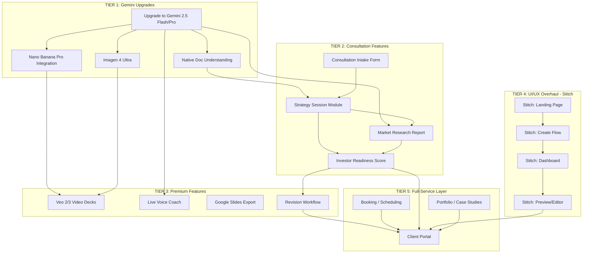

# pitchdeck.biz — Full-Service Gap Analysis & Gemini Integration Plan

> Generated: 2026-03-17
> Status: AWAITING REVIEW

## Current State

- v1.0 deployed at https://pitchdeck.biz
- ~95% real working code (37 pages, 28 API routes)
- End-to-end pipeline: Upload → Claude Analysis → Deck Gen → PPTX/PDF Export
- Stripe payments (pay-per-deck $99 + subscription $49/mo)
- Currently using: Claude Sonnet 4, OpenAI Whisper, Gemini 2.0 Flash (deprecated June 2026)

## Architecture Map

```
┌─────────────────────────────────────────────────────────────────────────────┐
│                        PITCHDECK.BIZ — GAP MAP                              │
│                     Current (solid) vs Gaps (dashed)                         │
└─────────────────────────────────────────────────────────────────────────────┘

USER ENTRY POINTS
═════════════════
  ┌──────────────┐   ┌╌╌╌╌╌╌╌╌╌╌╌╌╌╌╌┐   ┌╌╌╌╌╌╌╌╌╌╌╌╌╌╌╌╌╌┐
  │ Landing Page │   ╎ Consultation   ╎   ╎ Portfolio /      ╎
  │ (BUILT)      │   ╎ Intake Form    ╎   ╎ Case Studies     ╎
  └──────┬───────┘   ╎ (GAP)          ╎   ╎ (GAP)            ╎
         │           └╌╌╌╌╌╌╌┬╌╌╌╌╌╌╌┘   └╌╌╌╌╌╌╌╌┬╌╌╌╌╌╌╌╌┘
         │                    │                      │
         ▼                    ▼                      │
  ┌──────────────┐   ┌╌╌╌╌╌╌╌╌╌╌╌╌╌╌╌┐             │
  │ Create Flow  │   ╎ Strategy       ╎             │
  │ Upload/Voice │──▶╎ Session        ╎◀────────────┘
  │ (BUILT)      │   ╎ (GAP)          ╎
  └──────┬───────┘   └╌╌╌╌╌╌╌┬╌╌╌╌╌╌╌┘
         │                    │
         ▼                    ▼
AI PIPELINE
═══════════
  ┌──────────────┐   ┌╌╌╌╌╌╌╌╌╌╌╌╌╌╌╌┐   ┌╌╌╌╌╌╌╌╌╌╌╌╌╌╌╌╌╌┐
  │ Doc Extract  │   ╎ Gemini 2.5 Pro ╎   ╎ Gemini Native    ╎
  │ pdf-parse    │──▶╎ PDF Vision     ╎   ╎ Doc Understanding╎
  │ mammoth      │   ╎ (UPGRADE)      ╎   ╎ (REPLACE)        ╎
  │ (BUILT)      │   └╌╌╌╌╌╌╌┬╌╌╌╌╌╌╌┘   └╌╌╌╌╌╌╌╌╌╌╌╌╌╌╌╌╌┘
  └──────┬───────┘            │
         │                    │
         ▼                    ▼
  ┌──────────────┐   ┌╌╌╌╌╌╌╌╌╌╌╌╌╌╌╌┐
  │ Claude Sonnet│   ╎ Gemini 2.5 Pro ╎
  │ Analysis +   │   ╎ + Competitive  ╎
  │ Deck Gen     │   ╎ Research Layer ╎
  │ (BUILT)      │   ╎ (UPGRADE)      ╎
  └──────┬───────┘   └╌╌╌╌╌╌╌┬╌╌╌╌╌╌╌┘
         │                    │
         ▼                    ▼
IMAGE GENERATION
════════════════
  ┌──────────────┐   ┌╌╌╌╌╌╌╌╌╌╌╌╌╌╌╌┐   ┌╌╌╌╌╌╌╌╌╌╌╌╌╌╌╌╌╌┐
  │ Gemini 2.0   │   ╎ Nano Banana    ╎   ╎ Imagen 4         ╎
  │ Flash        │──▶╎ Pro            ╎   ╎ Ultra             ╎
  │ (BUILT)      │   ╎ Consistent     ╎   ╎ Hero/Stock        ╎
  │ + SVG fallbk │   ╎ branded imgs   ╎   ╎ (GAP)             ╎
  └──────┬───────┘   ╎ (UPGRADE)      ╎   └╌╌╌╌╌╌╌╌╌╌╌╌╌╌╌╌╌┘
         │           └╌╌╌╌╌╌╌╌╌╌╌╌╌╌╌┘
         │
         ▼
  ┌╌╌╌╌╌╌╌╌╌╌╌╌╌╌╌┐   ┌╌╌╌╌╌╌╌╌╌╌╌╌╌╌╌╌╌┐
  ╎ Veo 2/3        ╎   ╎ Live Voice Coach  ╎
  ╎ Animated decks ╎   ╎ Gemini Live API   ╎
  ╎ Motion slides  ╎   ╎ Pitch practice    ╎
  ╎ (GAP-PREMIUM)  ╎   ╎ (GAP-PREMIUM)     ╎
  └╌╌╌╌╌╌╌╌╌╌╌╌╌╌╌┘   └╌╌╌╌╌╌╌╌╌╌╌╌╌╌╌╌╌┘

EXPORT & DELIVERY
═════════════════
  ┌──────────────┐   ┌╌╌╌╌╌╌╌╌╌╌╌╌╌╌╌┐   ┌╌╌╌╌╌╌╌╌╌╌╌╌╌╌╌╌╌┐
  │ PPTX Export  │   ╎ Google Slides  ╎   ╎ Video Deck       ╎
  │ PDF Export   │   ╎ Export         ╎   ╎ Export (Veo)      ╎
  │ ZIP Bundle   │   ╎ (GAP)         ╎   ╎ (GAP)             ╎
  │ (BUILT)      │   └╌╌╌╌╌╌╌╌╌╌╌╌╌╌╌┘   └╌╌╌╌╌╌╌╌╌╌╌╌╌╌╌╌╌┘
  └──────────────┘

UI/UX LAYER (STITCH)
═════════════════════
  ┌──────────────┐   ┌╌╌╌╌╌╌╌╌╌╌╌╌╌╌╌┐   ┌╌╌╌╌╌╌╌╌╌╌╌╌╌╌╌╌╌┐
  │ Functional   │   ╎ Stitch-designed╎   ╎ Stitch-designed   ╎
  │ but generic  │──▶╎ Landing Page   ╎   ╎ Dashboard         ╎
  │ shadcn/ui    │   ╎ (REDESIGN)     ╎   ╎ Create Flow       ╎
  │ (BUILT)      │   ╎                ╎   ╎ Preview/Edit      ╎
  └──────────────┘   └╌╌╌╌╌╌╌╌╌╌╌╌╌╌╌┘   ╎ (REDESIGN)        ╎
                                           └╌╌╌╌╌╌╌╌╌╌╌╌╌╌╌╌╌┘

CONSULTATION SERVICE LAYER (ALL GAPS)
═════════════════════════════════════
  ┌──────────────┐  ┌──────────────┐  ┌──────────────┐
  │ Booking /    │  │ Strategy     │  │ Revision     │
  │ Scheduling   │  │ Deck Review  │  │ Workflow     │
  │ Calendar     │  │ AI + Human   │  │ Feedback     │
  └──────────────┘  └──────────────┘  └──────────────┘

  ┌──────────────┐  ┌──────────────┐  ┌──────────────┐
  │ Market       │  │ Investor     │  │ Client       │
  │ Research     │  │ Readiness    │  │ Portal       │
  │ Report       │  │ Score        │  │ Login        │
  └──────────────┘  └──────────────┘  └──────────────┘
```

## Dependency Graph



## Component Breakdown

### Gap Category A: Gemini API Upgrades

| Component | Purpose | Inputs | Outputs | Dependencies |
|---|---|---|---|---|
| Gemini 2.5 Flash | Replace deprecated 2.0 Flash | Text, images | JSON, text | New SDK |
| Gemini 2.5 Pro | Deep analysis, strategy reports | Docs, audio, images | Analysis JSON | API key |
| Nano Banana Pro | Branded slide visuals, text accuracy | Prompts + 14 ref imgs | Consistent illustrations | 2.5 Flash |
| Imagen 4 Ultra | Hero images, stock backgrounds | Text prompts | High-res images | Gemini API |
| Native Doc Understanding | Replace pdf-parse + mammoth | PDF/DOCX via Files API | Structured extraction | 2.5 Pro |
| Structured Output | Force JSON schema on all calls | Zod schemas | Typed responses | All Gemini |

### Gap Category B: Consultation Service

| Component | Purpose | Inputs | Outputs | Dependencies |
|---|---|---|---|---|
| Consultation Intake | Discovery questionnaire | User answers | Business profile JSON | Stitch UI |
| Strategy Session | AI-guided business review | Intake + docs | Strategy brief | Gemini 2.5 Pro |
| Market Research Report | Competitive landscape scan | Industry, location | PDF report | Gemini 2.5 Pro |
| Investor Readiness Score | Fundraising preparedness | Business analysis | Score + gaps | Strategy output |
| Revision Workflow | Client feedback loop | Comments on slides | Updated deck | Deck gen pipeline |
| Booking/Scheduling | Human consultation calls | Time slots | Appointment | Cal.com API |

### Gap Category C: Premium Features

| Component | Purpose | Inputs | Outputs | Dependencies |
|---|---|---|---|---|
| Veo 2/3 Video Decks | Animated slide export | Slides + prompts | Video deck | Nano Banana |
| Live Voice Coach | Real-time pitch practice | Mic stream | Feedback + score | Gemini Live API |
| Google Slides Export | Native GSlides format | Deck JSON | GSlides link | Google Slides API |
| Portfolio / Case Studies | Showcase past work | Curated examples | Static pages | Stitch design |

### Gap Category D: Stitch UI/UX

| Component | Purpose | Inputs | Outputs | Dependencies |
|---|---|---|---|---|
| Landing Page | Premium conversion homepage | Current content | Stitch screens | DESIGN.md |
| Create Flow | Guided consultation wizard | Current 3-step | Polished UX | Intake design |
| Dashboard | Client portal feel | Current dashboard | Professional UI | Revision workflow |
| Preview/Editor | Interactive slide viewer | Deck JSON | Visual editor | Nano Banana Pro |

## Gemini API Stack (Recommended)

| Layer | Current | Target | Est. Cost |
|---|---|---|---|
| Content gen | Claude Sonnet 4 | Keep Claude + add Gemini 2.5 Pro | $1.25/$10 per M tokens |
| Fast ops | Gemini 2.0 Flash | Gemini 2.5 Flash | $0.30/$2.50 per M tokens |
| Slide images | Gemini 2.0 Flash | Nano Banana Pro | $0.04-$0.13/image |
| Hero images | SVG fallback | Imagen 4 Ultra | $0.06/image |
| Video (premium) | None | Veo 2/3 | $0.10-$0.35/second |
| Doc processing | pdf-parse + mammoth | Gemini Files API + 2.5 Pro | Token cost only |
| Voice input | OpenAI Whisper | Gemini 2.5 Flash audio | Token cost only |
| Voice coach | None | Gemini Live API | TBD |

## Critical Note
Gemini 2.0 Flash is deprecated and shuts down June 1, 2026. Migration to 2.5 Flash is mandatory.
